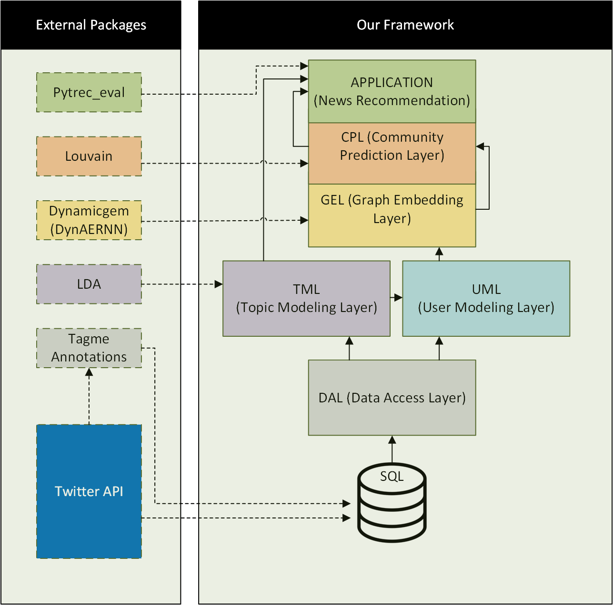

# Community Prediction in Microblogging Social Networks

This is an open-source python-based framework to predict the future user communities in a text streaming social network (e.g., Twitter) based on the users’ topics of interest.

## Installation

It is strongly recommended to use Linux OS for installing the packages and executing the framework. To install packages and dependencies, simply use this command in your shell:

```bash
 pip install -r requirements.txt
```
This command installs compatible version of the following libraries:
* gensim
* networkx
* scikit-network
* dynamicgem
* tagme
* nltk
* numpy
* pandas
* scikit-learn
* scipy
* sklearn
* requests
* mysql-connector-python
* matplotlib

## Structure

### Framework Structure
Our framework has six major layers: Data Access Layer (DAL),
Topic Modeling Layer (TML), User Modeling Layer (UML), Graph
Embedding Layer (GEL), and Community Prediction Layer (CPL).
The application layer, is the last
layer to show how our method improves the performance of an application.




### Code Structure
│── **output**\
│── **src**\
│&nbsp;&nbsp;&nbsp;│\
│&nbsp;&nbsp;&nbsp;│── **cmn** (common functions)\
│&nbsp;&nbsp;&nbsp;│──── *Common.py*\
│&nbsp;&nbsp;&nbsp;│\
│&nbsp;&nbsp;&nbsp;│── **dal**  (data access layer)\
│&nbsp;&nbsp;&nbsp;│──── *DataPreparation.py*\
│&nbsp;&nbsp;&nbsp;│──── *DataReader.py*\
│&nbsp;&nbsp;&nbsp;│\
│&nbsp;&nbsp;&nbsp;│── **tml**  (topic modeling layer)\
│&nbsp;&nbsp;&nbsp;│──── *TopicModeling.py*\
│&nbsp;&nbsp;&nbsp;│\
│&nbsp;&nbsp;&nbsp;│── **uml** (user modeling layer)\
│&nbsp;&nbsp;&nbsp;│──── *UsersGraph.py*\
│&nbsp;&nbsp;&nbsp;│──── *UserSimilarities.py*\
│&nbsp;&nbsp;&nbsp;│\
│&nbsp;&nbsp;&nbsp;│── **gel** (graph embedding layer)\
│&nbsp;&nbsp;&nbsp;│──── *GraphEmbedding.py*\
│&nbsp;&nbsp;&nbsp;│──── *GraphReconstruction.py*\
│&nbsp;&nbsp;&nbsp;│\
│&nbsp;&nbsp;&nbsp;│── **cpl** (community prediction layer)\
│&nbsp;&nbsp;&nbsp;│──── *GraphClustering.py*\
│&nbsp;&nbsp;&nbsp;│\
│&nbsp;&nbsp;&nbsp;│── **application**\
│&nbsp;&nbsp;&nbsp;│──── *NewsTopicExtraction.py*\
│&nbsp;&nbsp;&nbsp;│──── *NewsRecommendation.py*\
│&nbsp;&nbsp;&nbsp;│──── *ModelEvaluation.py*\
│&nbsp;&nbsp;&nbsp;│── *main.py*\
│&nbsp;&nbsp;&nbsp;│── *params.py*\
│── *requirements.txt*


## Usage

### Data


### Run
This framework contains six different layers. Each layer is affected by multiple parameters.
Some of those parameters are fixed in the code via trial and error. However, major parameters such as number of topics can be adjusted by the user.
They can be modified via '*params.py*' file in root folder.\
After modifying '*params.py*', you can run the framework via '*main.py*' with following command:
```bash
cd src
python main.py
```
## Examples
### **params.py**
```python
import random
import numpy as np

random.seed(0)
np.random.seed(0)
RunID = 1                         


# SQL setting
# mallet home path
#
uml = {
    'Comment': '', # Any comment to express more information about the configuration.
    'RunId': RunID, # A unique number to identify the configuration per run.

    'start': '2010-12-17', # First date of system activity
    'end': '2010-12-17', # Last day of system activity
    'lastRowsNumber': 100000, # Number of picked rows of the dataset for the whole process as a sample.

    'num_topics': 25, # Number of topics that should be extracted from our corpus.
    'library': 'gensim', # Used library to extract topics from the corpus. Could be 'gensim' or 'mallet'

    'mallet_home': '--------------', # mallet_home path
    
    # Following parameters is used to generate corpus from our dataset:
    'userModeling': True, # Aggregates all tweets of a user as a document
    'timeModeling': True, # Aggregate all tweets of a specific day as a document
    'preProcessing': False, # Applying some traditional pre-processing methods on corpus
    'TagME': False, # Apply Tagme on the raw dataset. Set it to False if tagme-dataset is used.
     

    'filterExtremes': True, # Filter very common and very rare terms in all documents.
    'JO': False, # (JO:=JustOne) If True, just one topic is chosen for each document
    'Bin': True, # (Bin:=Binary) If True, all scores above/below a threshold is set to 1/0 for each topic
    'Threshold': 0.2, # A threshold for topic scores quantization.
    'UserSimilarityThreshold': 0.2 # A threshold for filtering low user similarity scores.
}

evl = {
    'RunId': RunID,
    'Threshold': 0, # A threshold for filtering low news recommendation scores.
    'TopK': 20 # Number of selected top news recommendation candidates.
}
```

## Contributing
Pull requests are welcome. For major changes, please open an issue first to discuss what you would like to change.


## License
©2021. This work is licensed under a [CC BY-NC-SA 4.0](LICENSE.txt) license.

## Contact
Email: [ziaeines@uwindsor.ca](mailto:ziaeines@uwindsor.ca) - [soroushziaeinejad@gmail.com](mailto:soroushziaeinejad@gmail.com)\
Project link: [https://github.com/soroush-ziaeinejad/Community-Prediction](https://github.com/soroush-ziaeinejad/Community-Prediction)
## Acknowledgments
In this work, we use [dynamicgem](https://github.com/Sujit-O/dynamicgem) library to temporally embed our user graphs. We would like to thank the authors of this library.


