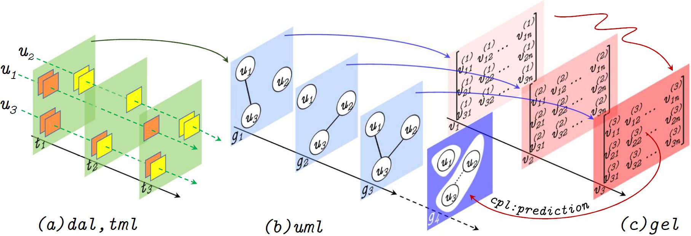
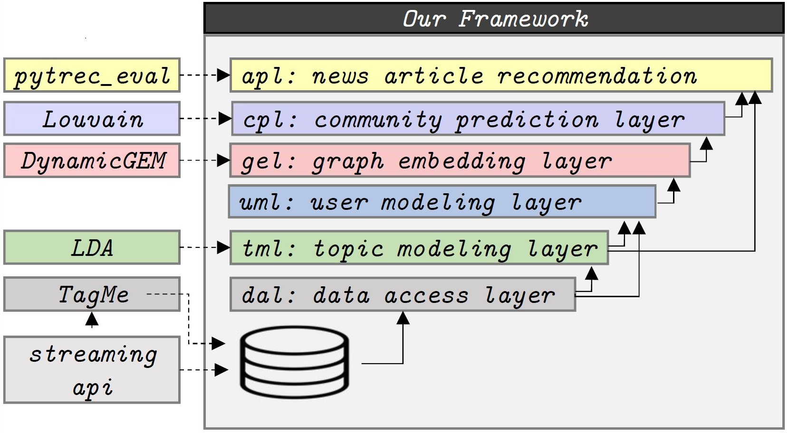

# A Framework for Community Prediction in Online Social Networks with Streaming Content
This is an open-source ``extensible`` ``end-to-end`` python-based [``framework``](https://martinfowler.com/bliki/InversionOfControl.html) to predict the future user communities in a text streaming social network (e.g., Twitter) based on the users’ topics of interest. User community prediction aims at identifying communities in the future based on the users' temporal topics of interest. We model inter-user topical affinities at each time interval via streams of temporal graphs. Our framework benefits from temporal graph embedding methods to learn temporal vector representations for users as users' topics of interests and hence their inter-user topical affinities are changing in time. We predict user communities in future time intervals based on the final locations of users' vectors in the latent space. Our framework employs ``layered software design`` that adds modularity, maintainability,  ease of extensibility, and stability against customization and ad hoc changes to its components including ``topic modeling``, ``user modeling``, ``temporal user embedding``, ``user community prediction`` and ``evaluation``. More importantly, our framework further offers one-stop shop access to future communities to improve recommendation systems and advertising campaigns. Our proposed framework has already been benchmarked on a Twitter dataset and showed improvements compared to the state of the art in underlying applications such as ``news recommendation`` and user ``prediction`` (see [here](https://hosseinfani.github.io/res/papers/Temporal%20Latent%20Space%20Modeling%20For%20Community%20Prediction.pdf), also below).

1. [Demo](#1-Demo)
2. [Structure](#2-Structure)
3. [Setup](#3-Setup)
4. [Usage](#4-Usage)
5. [Result](#5-Result)
6. [License](#6-License)
7. [Contributing](#7-Contributing)

## 1. Demo
:movie_camera: [Video Playlist](): 1) [Introduction]() -> 2) [Installation]() ->3) [Extension]()

Workflow | Layers
:---------------:|:-------------------------:
 | 

## 2. Structure

### Framework Structure
Our framework has six major layers: Data Access Layer (DAL),
Topic Modeling Layer (TML), User Modeling Layer (UML), Graph
Embedding Layer (GEL), and Community Prediction Layer (CPL).
The application layer, is the last
layer to show how our method improves the performance of an application.

### Code Structure
│── **output**\
│── **src**\
│&nbsp;&nbsp;&nbsp;│\
│&nbsp;&nbsp;&nbsp;│── **cmn** (common functions)\
│&nbsp;&nbsp;&nbsp;│──── *Common.py*\
│&nbsp;&nbsp;&nbsp;│\
│&nbsp;&nbsp;&nbsp;│── **dal**  (data access layer)\
│&nbsp;&nbsp;&nbsp;│──── *DataPreparation.py*\
│&nbsp;&nbsp;&nbsp;│──── *DataReader.py*\
│&nbsp;&nbsp;&nbsp;│\
│&nbsp;&nbsp;&nbsp;│── **tml**  (topic modeling layer)\
│&nbsp;&nbsp;&nbsp;│──── *TopicModeling.py*\
│&nbsp;&nbsp;&nbsp;│\
│&nbsp;&nbsp;&nbsp;│── **uml** (user modeling layer)\
│&nbsp;&nbsp;&nbsp;│──── *UsersGraph.py*\
│&nbsp;&nbsp;&nbsp;│──── *UserSimilarities.py*\
│&nbsp;&nbsp;&nbsp;│\
│&nbsp;&nbsp;&nbsp;│── **gel** (graph embedding layer)\
│&nbsp;&nbsp;&nbsp;│──── *GraphEmbedding.py*\
│&nbsp;&nbsp;&nbsp;│──── *GraphReconstruction.py*\
│&nbsp;&nbsp;&nbsp;│\
│&nbsp;&nbsp;&nbsp;│── **cpl** (community prediction layer)\
│&nbsp;&nbsp;&nbsp;│──── *GraphClustering.py*\
│&nbsp;&nbsp;&nbsp;│\
│&nbsp;&nbsp;&nbsp;│── **application**\
│&nbsp;&nbsp;&nbsp;│──── *NewsTopicExtraction.py*\
│&nbsp;&nbsp;&nbsp;│──── *NewsRecommendation.py*\
│&nbsp;&nbsp;&nbsp;│──── *ModelEvaluation.py*\
│&nbsp;&nbsp;&nbsp;│── *main.py*\
│&nbsp;&nbsp;&nbsp;│── *params.py*\
│── *requirements.txt*

## 3. Setup

It is strongly recommended to use Linux OS for installing the packages and executing the framework. To install packages and dependencies, simply use this command in your shell:

```bash
 pip install -r requirements.txt
```
This command installs compatible version of the following libraries:

>* dal: ``mysql-connector-python``
>* tml: ``gensim, tagme, nltk, pandas, requests``
>* gel: ``networkx, dynamicgem``
>* others: ``scikit-network, scikit-learn, sklearn, numpy, scipy, matplotlib``

## 4. Usage

### Data
We crawled and stored Twitter posts (tweets) for 2 consecutive months.
The data is available as some sql scripts that should be executed.
They are accessible through the following links. Please download and execute
them into your local database engine. Please be sure that your sql engine is
working when you start to run the framework.
* [GoldenStandard](https://uwin365.sharepoint.com/:u:/r/sites/cshfrg-CommunityPrediction/Shared%20Documents/Community%20Prediction/Projects/User_Community_Prediction/Data/golden_standard.sql?csf=1&web=1&e=DdsSPk)
* [NewsTables](https://uwin365.sharepoint.com/:u:/r/sites/cshfrg-CommunityPrediction/Shared%20Documents/Community%20Prediction/Projects/User_Community_Prediction/Data/news_tables.zip?csf=1&web=1&e=lrKwxs)
* [TagMeTables](https://uwin365.sharepoint.com/:u:/r/sites/cshfrg-CommunityPrediction/Shared%20Documents/Community%20Prediction/Projects/User_Community_Prediction/Data/tagme_tables.rar?csf=1&web=1&e=Ny5VRY)
* [TagmeAnnotations](https://uwin365.sharepoint.com/:u:/r/sites/cshfrg-CommunityPrediction/Shared%20Documents/Community%20Prediction/Projects/User_Community_Prediction/Data/tagmeannotations.rar?csf=1&web=1&e=PDtoi3)
* [TweetEntities](https://uwin365.sharepoint.com/:u:/r/sites/cshfrg-CommunityPrediction/Shared%20Documents/Community%20Prediction/Projects/User_Community_Prediction/Data/tweet_entities.rar?csf=1&web=1&e=RM5fr8)
* [TweetUsers](https://uwin365.sharepoint.com/:u:/r/sites/cshfrg-CommunityPrediction/Shared%20Documents/Community%20Prediction/Projects/User_Community_Prediction/Data/tweets_users.rar?csf=1&web=1&e=PisPI3)
### Run
This framework contains six different layers. Each layer is affected by multiple parameters.
Some of those parameters are fixed in the code via trial and error. However, major parameters such as number of topics can be adjusted by the user.
They can be modified via '*params.py*' file in root folder.\
After modifying '*params.py*', you can run the framework via '*main.py*' with following command:
```bash
cd src
python main.py
```
### Examples
#### **params.py**
```python
import random
import numpy as np

random.seed(0)
np.random.seed(0)
RunID = 1                         

# SQL setting. Should be set for each mysql instance
user = ''
password = ''
host = ''
database = ''


uml = {
    'Comment': '', # Any comment to express more information about the configuration.
    'RunId': RunID, # A unique number to identify the configuration per run.

    'start': '2010-12-17', # First date of system activity
    'end': '2010-12-17', # Last day of system activity
    'lastRowsNumber': 100000, # Number of picked rows of the dataset for the whole process as a sample.

    'num_topics': 25, # Number of topics that should be extracted from our corpus.
    'library': 'gensim', # Used library to extract topics from the corpus. Could be 'gensim' or 'mallet'

    'mallet_home': '--------------', # mallet_home path
    
    # Following parameters is used to generate corpus from our dataset:
    'userModeling': True, # Aggregates all tweets of a user as a document
    'timeModeling': True, # Aggregate all tweets of a specific day as a document
    'preProcessing': False, # Applying some traditional pre-processing methods on corpus
    'TagME': False, # Apply Tagme on the raw dataset. Set it to False if tagme-dataset is used.
     

    'filterExtremes': True, # Filter very common and very rare terms in all documents.
    'JO': False, # (JO:=JustOne) If True, just one topic is chosen for each document
    'Bin': True, # (Bin:=Binary) If True, all scores above/below a threshold is set to 1/0 for each topic
    'Threshold': 0.2, # A threshold for topic scores quantization.
    'UserSimilarityThreshold': 0.2 # A threshold for filtering low user similarity scores.
}

evl = {
    'RunId': RunID,
    'Threshold': 0, # A threshold for filtering low news recommendation scores.
    'TopK': 20 # Number of selected top news recommendation candidates.
}
```
## 5. Result
<table style="color:#828282;">
    <tr style=" color:black;" align="center">
        <th style="background-color:#A8A8A8;" rowspan="2">Method</th>
        <th style="background-color:#A8A8A8;" colspan="3">News Recommendation</th>
        <th style="background-color:#A8A8A8;" colspan="3">User Prediction</th>
    </tr>
    <tr style="color:black;">
        <th style="background-color:#A8A8A8;">mrr</th>
        <th style="background-color:#A8A8A8;">ndcg5</th>
        <th style="background-color:#A8A8A8;">ndcg10</th>
        <th style="background-color:#A8A8A8;">Precision</th>
        <th style="background-color:#A8A8A8;">Recall</th>
        <th style="background-color:#A8A8A8;">f1-measure</th>
    </tr>
    <tr>
        <th style="text-align:left; color:black; background-color:#FBF0CE" colspan="7"> Community Prediction </th>
    </tr>
    <tr>
        <th style="color:black;">Our approach</th>
        <th style="color:black;">0.255</th>
        <th style="color:black;">0.108</th>
        <th style="color:black;">0.105</th>
        <th style="color:black;">0.012</th>
        <th>0.035</th>
        <th style="color:black;">0.015</th>
    </tr>
    <tr>
        <th style="color:black;">Appel et al. [PKDD' 18]</th>
        <th>0.176</th>
        <th>0.056</th>
        <th>0.055</th>
        <th>0.007</th>
        <th>0.094</th>
        <th>0.0105</th>
    </tr>
        <th style="text-align:left; color:black; background-color:#FBF0CE" colspan="7"> Temporal community detection </th>
        <tr>
        <th style="color:black;">Hu et al. [SIGMOD’15]</th>
        <th>0.173</th>
        <th>0.056</th>
        <th>0.049</th>
        <th>0.007</th>
        <th>0.136</th>
        <th>0.013</th>
    </tr>
        <th style="color:black;">Fani et al.    [CIKM’17]</th>
        <th>0.065</th>
        <th>0.040</th>
        <th>0.040</th>
        <th>0.007</th>
        <th>0.136</th>
        <th>0.013</th>
    </tr>
        <th style="text-align:left; color:black; background-color:#FBF0CE" colspan="7"> Non-temporal link-based community detection </th>
    <tr>
        <th style="color:black;">Ye et al.[CIKM’18]</th>
        <th>0.139</th>
        <th>0.056</th>
        <th>0.055</th>
        <th>0.008</th>
        <th>0.208</th>
        <th>0.014</th>
    </tr>
        <th style="color:black;">Louvain[JSTAT’08]</th>
        <th>0.108</th>
        <th>0.048</th>
        <th>0.055</th>
        <th>0.004</th>
        <th>0.129</th>
        <th>0.007</th>
    </tr>
        <th style="text-align:left; color:black;background-color:#FBF0CE" colspan="7"> Collaborative filtering </th>
    </tr>
        <th style="color:black;">rrn[WSDM’17]</th>
        <th>0.173</th>
        <th>0.073</th>
        <th>0.08</th>
        <th>0.004</th>
        <th style="color:black;">0.740</th>
        <th>0.008</th>
    </tr>
    <tr>
        <th style="color:black;">timesvd++    [KDD’08]</th>
        <th>0.141</th>
        <th>0.058</th>
        <th>0.064</th>
        <th>0.003</th>
        <th>0.657</th>
        <th>0.005</th>
    </tr>
</table>

## 6. Contributing
Pull requests are welcome. For major changes, please open an issue first to discuss what you would like to change.

## 7. License
©2021. This work is licensed under a [CC BY-NC-SA 4.0](LICENSE.txt) license.

### Contact
Email: [ziaeines@uwindsor.ca](mailto:ziaeines@uwindsor.ca) - [soroushziaeinejad@gmail.com](mailto:soroushziaeinejad@gmail.com)\
Project link: [https://github.com/soroush-ziaeinejad/Community-Prediction](https://github.com/soroush-ziaeinejad/Community-Prediction)

### Acknowledgments
In this work, we use [dynamicgem](https://github.com/Sujit-O/dynamicgem) library to temporally embed our user graphs. We would like to thank the authors of this library.


